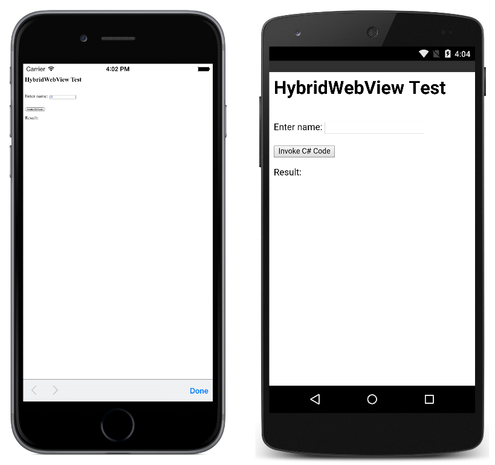

# HybridWebView Custom Renderer

This sample demonstrates a custom renderer for a `HybridWebView` custom control, that demonstrates how to enhance the platform-specific web controls to allow C# code to be invoked from JavaScript.

For more information about this sample see [Implementing a HybridWebView](https://docs.microsoft.com/xamarin/xamarin-forms/app-fundamentals/custom-renderer/hybridwebview).

