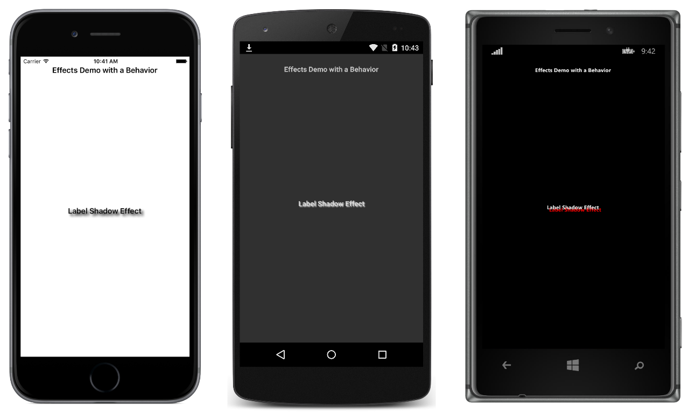

# Effect Behavior

Behaviors are a useful approach for adding an effect to a control, removing boiler-plate effect handling code from code-behind files. This sample demonstrates using a behavior to add an effect to a control.

For more information about this sample, see [Behaviors](https://developer.xamarin.com/guides/xamarin-forms/behaviors/).

