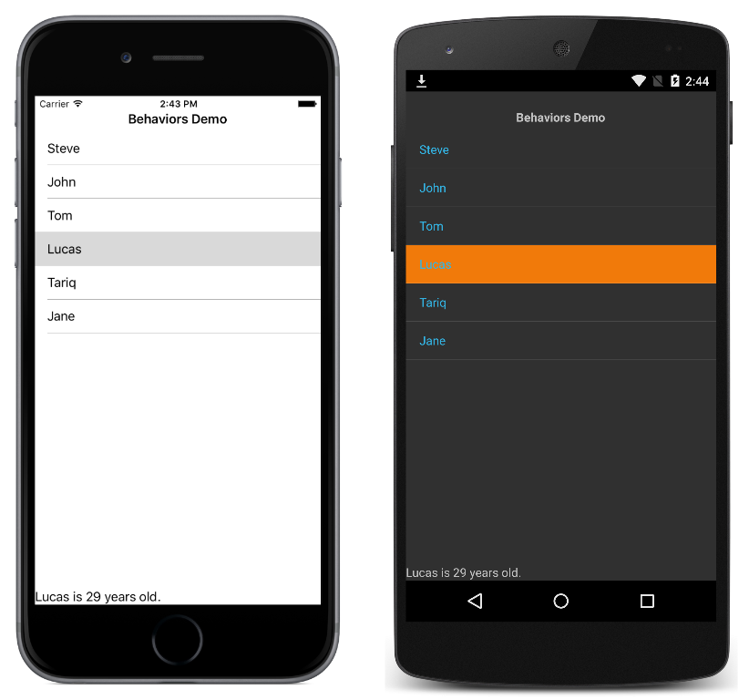

# Event to Command Behavior

In the context of commanding, behaviors are a useful approach for connecting a control to a command. In addition, they can also be used to associate commands with controls that were not designed to interact with commands. This sample demonstrates using a behavior to invoke a command when an event fires.

For more information about this sample, see [Reusable EventToCommandBehavior](https://docs.microsoft.com/xamarin/xamarin-forms/app-fundamentals/behaviors/reusable/event-to-command-behavior).

