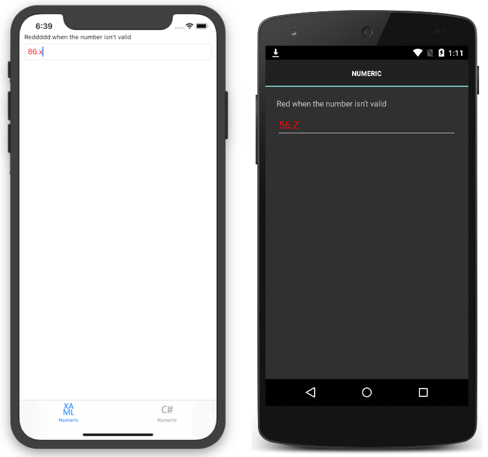

# NumericValidation Behavior

Xamarin.Forms behaviors are created in a class that derives from the Behavior, or Behavior&lt;T&gt; class. This sample demonstrates how to create and consume a Xamarin.Forms behavior.

For more information about this sample, see [Behaviors](https://developer.xamarin.com/guides/xamarin-forms/behaviors/).

