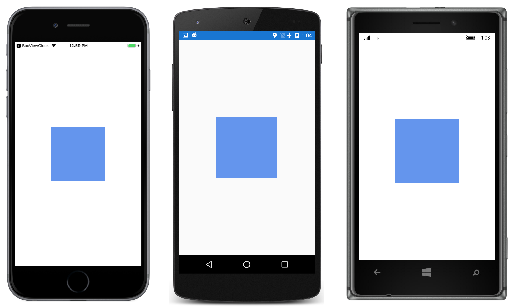

# Basic BoxView

Just a `BoxView` on the page, demonstrating the `Color`, `WidthRequest`, and `HeightRequest` properties.

This sample is described in more detail in the article on [BoxView](/guides/xamarin-forms/user-interface/boxview/).

