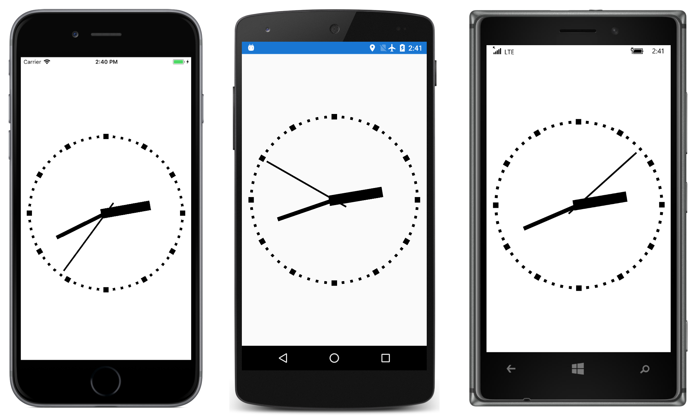

# BoxView Clock

A classic analog clock realized entirely with `BoxView`.

Although Xamarin.Forms doesn't have a vector graphics programming interface, it does have a `BoxView`. Although normally used for displaying rectangular blocks of color, `BoxView` can be sized, positioned, and rotated. This is enough to render a classic analog clock.

This sample is described in more detail in the article on [BoxView](/guides/xamarin-forms/user-interface/boxview/).

