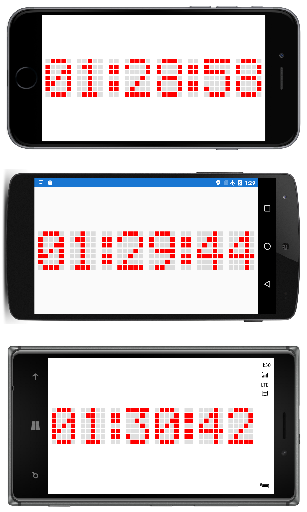

# Dot-Matrix Clock

The `BoxView` element is ideal for creating a simulation of a dot-matrix digital display.

This sample is described in more detail in the article on [BoxView](/guides/xamarin-forms/user-interface/boxview/).

## Author

Charles Petzold

