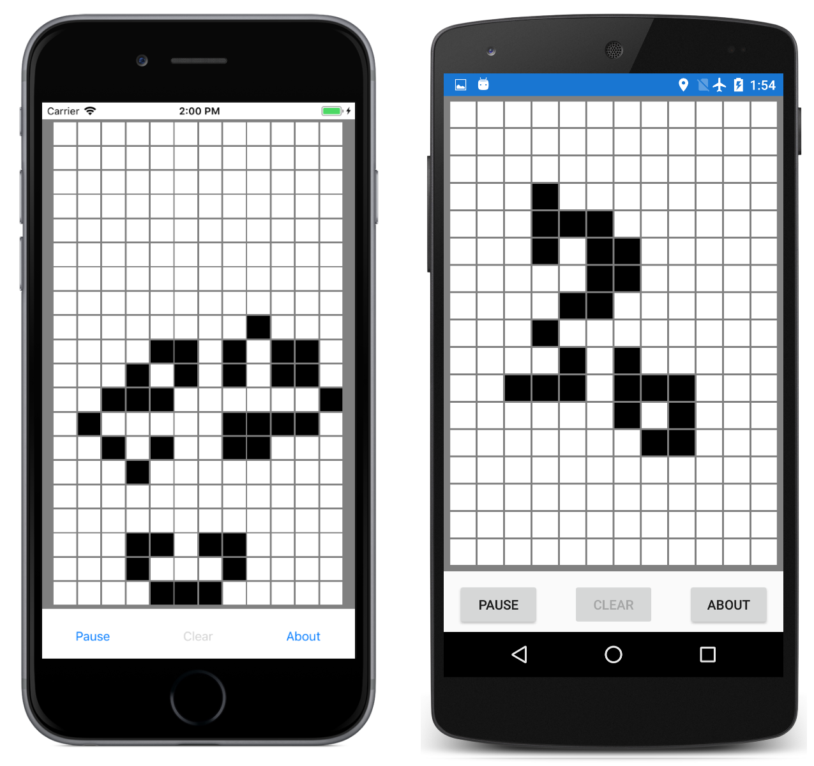

# Game of Life

This is an implementation of the Game of Life for Xamarin.Forms.
Life is a cellular automaton invented by mathematician John Conway in 1970 and popularized in *Scientfic American*.

Tap cells to make them "alive" A clustered population of live cells works the best.
Then press the **Run!** button. Rules are applied to the live cells to generate successive populations.
A population might grow, or shrink, or stagnate, or disappear.

For more information about the Game of Life, see the Wikipedia article [Conway's Game of Life](https://en.wikipedia.org/wiki/Conway's_Game_of_Life).

This sample is described in more detail in the article on [BoxView](https://docs.microsoft.com/xamarin/xamarin-forms/user-interface/boxview).

