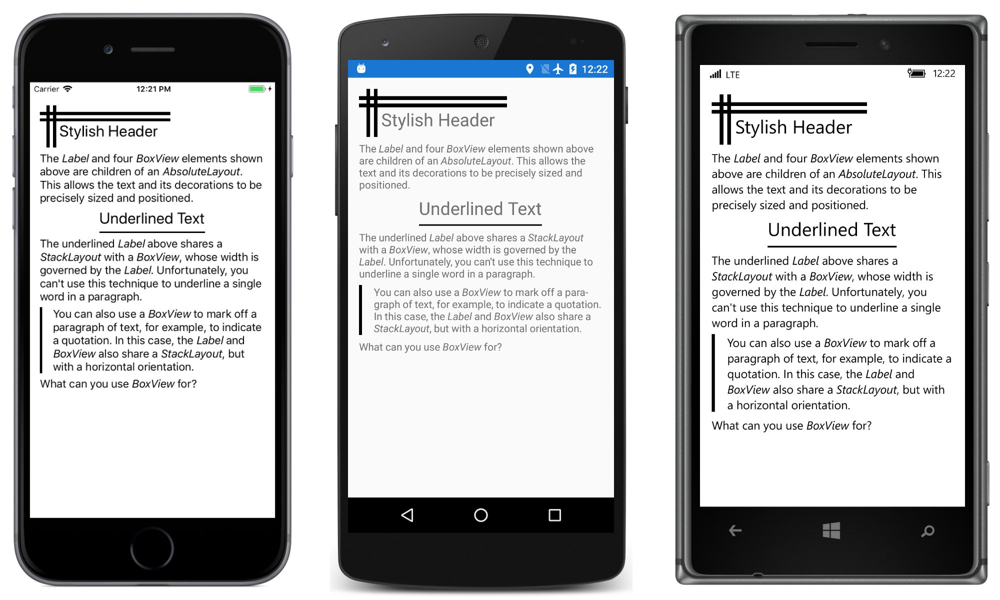

# Text Decoration

One simple application of the `BoxView` element is for adorning text with horizontal and vertical lines.

This sample is described in more detail in the article on [BoxView](/guides/xamarin-forms/user-interface/boxview/).

## Author

Charles Petzold

