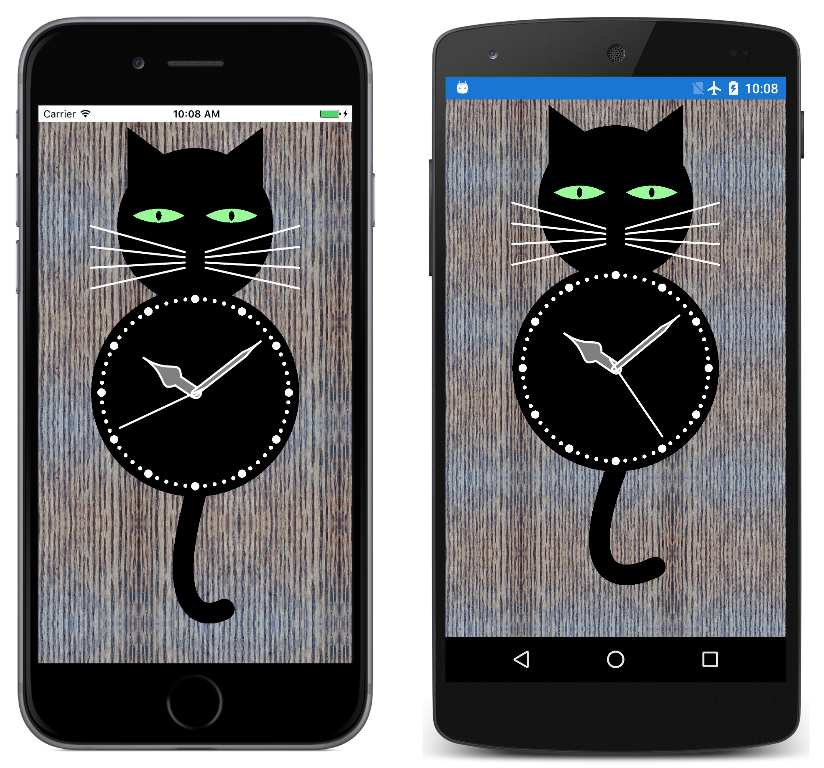

# Cat Clock

Cat Clock is a Xamarin.Forms application that demonstrates various features of SkiaSharp graphics. It runs on iOS, Android, and Universal Windows Platform devices.

This program was the focus of a webinar. To see the program built from the ground up, watch the video [SkiaSharp Graphics for Xamarin Forms](https://www.youtube.com/watch?v=fF0tzA6wUhA).

## Author

Charles Petzold
