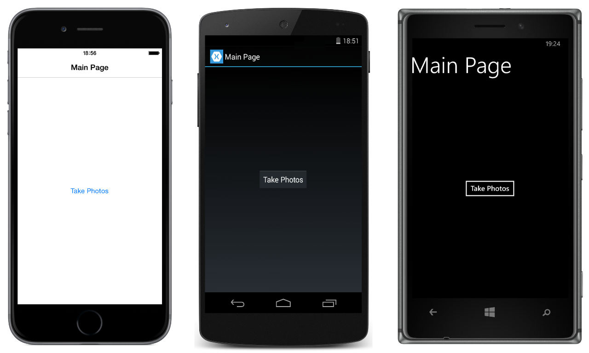

# ContentPage Custom Renderer

This sample demonstrates a custom renderer for a `ContentPage`, enabling developers to override the default native rendering with their own platform-specific customization.

For more information about this sample see [Customizing a ContentPage](https://docs.microsoft.com/xamarin/xamarin-forms/app-fundamentals/custom-renderer/contentpage).

