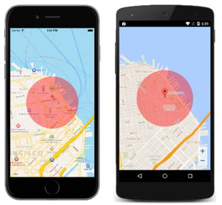

# Circle Map Overlay

This sample demonstrates how to add a circular overlay to a map in order to highlight a circular area of the map.

For more information about this sample see [Highlighting a Circular Area on a Map](https://docs.microsoft.com/xamarin/xamarin-forms/app-fundamentals/custom-renderer/map/circle-map-overlay).

