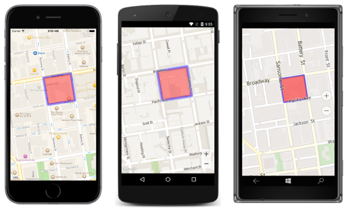

# Polygon Map Overlay

This sample demonstrates how to add a polygon overlay to a map in order to highlight a region on the map. Polygons are a closed shape and have their interiors filled in.

For more information about this sample see [Highlighting a Region on a Map](https://docs.microsoft.com/xamarin/xamarin-forms/app-fundamentals/custom-renderer/map/polygon-map-overlay).

