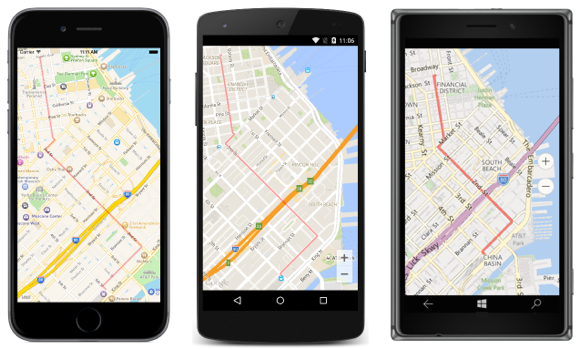

# Polyline Map Overlay

This sample demonstrates how to add a polyline overlay to a map. A polyline overlay is a series of connected line segments that are typically used to show a route on a map, or form any shape that's required.

For more information about this sample see [Highlighting a Circular Area on a Map](http://developer.xamarin.com/guides/xamarin-forms/custom-renderer/map/polyline-map-overlay/).

## Author

David Britch
