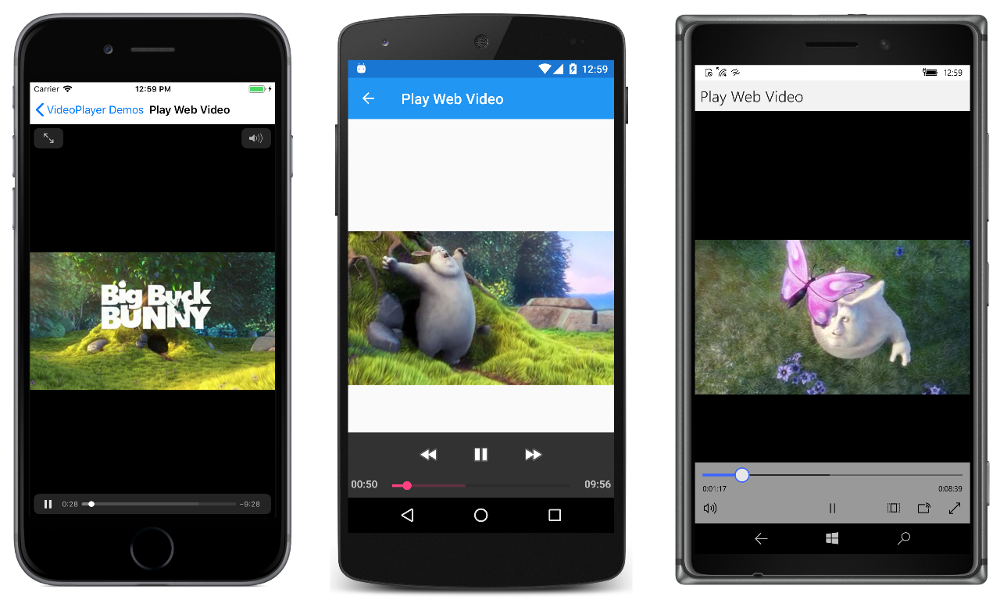

# Video Player Demos

This sample demonstrates renderers for a `VideoPlayer` custom control.

For more information about this sample see [Implementing a Video Player](https://developer.xamarin.com/guides/xamarin-forms/application-fundamentals/custom-renderer/video-player/).

