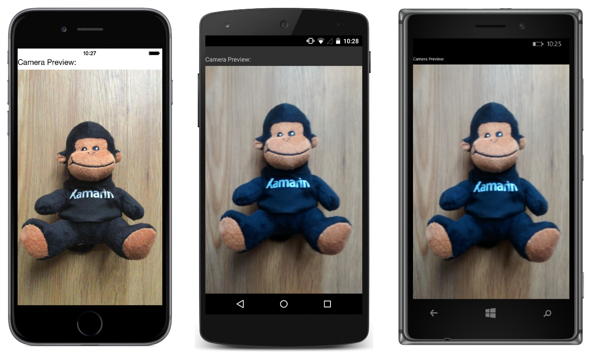

# View Custom Renderer

This sample demonstrates a custom renderer for a Xamarin.Forms custom control that's used to display a preview video stream from the device's camera.

For more information about this sample see [Implementing a View](http://developer.xamarin.com/guides/cross-platform/xamarin-forms/custom-renderer/view/).

## Author

David Britch
