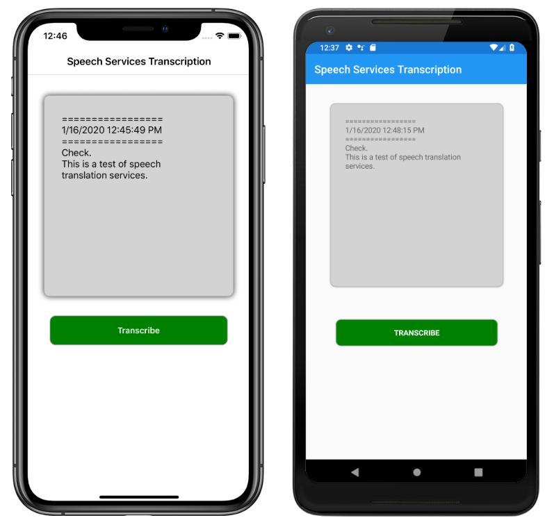

# Azure Speech Service Sample

Azure Speech Service, part of Azure Cognitive Services, allows you to add speech recognition to your mobile app. This sample demonstrates how to use Azure Speech Service to transcribe speech to text in a Xamarin.Forms app.

For more information, see [Speech recognition using Azure Speech Service](https://docs.microsoft.com/xamarin/xamarin-forms/data-cloud/azure-cognitive-services/speech-recognition).

