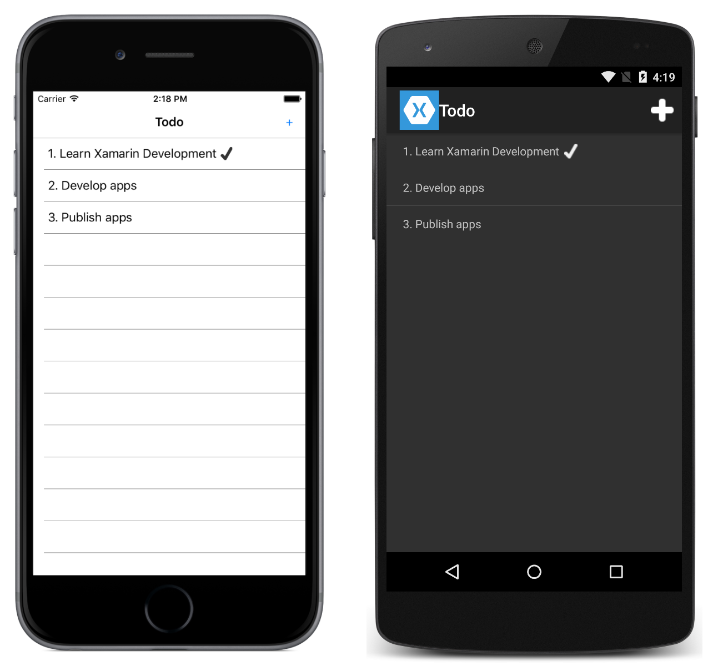

# Deep Linking

Application indexing allows applications that would otherwise be forgotten after a few uses to stay relevant by appearing in search results. Deep linking allows applications to respond to a search result that contains application data, typically by navigating to a page referenced from a deep link. This sample demonstrates how to use application indexing and deep linking to make Xamarin.Forms application content searchable on iOS and Android devices.

Note: to use this sample on Android, you must add your **google-services.json** (downloaded from the Firebase console) file to the Android project, and set the build action to **GoogleServicesJson**.

For more information about this sample, see [Application Indexing and Deep Linking](https://developer.xamarin.com/guides/xamarin-forms/working-with/deep-linking/).

## Author

David Britch
