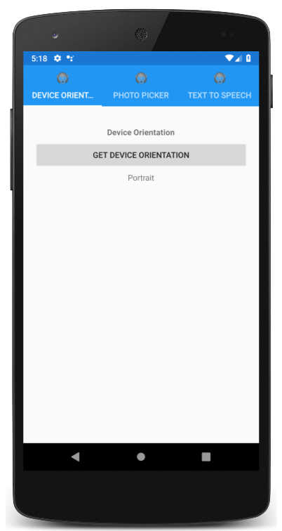

# Dependency Service

This sample demonstrates how to use the `DependencyService` class, which is a service locator that enables Xamarin.Forms applications to invoke native platform functionality from shared code.

For more information about this sample see [Xamarin.Forms DependencyService](https://docs.microsoft.com/xamarin/xamarin-forms/app-fundamentals/dependency-service/).

