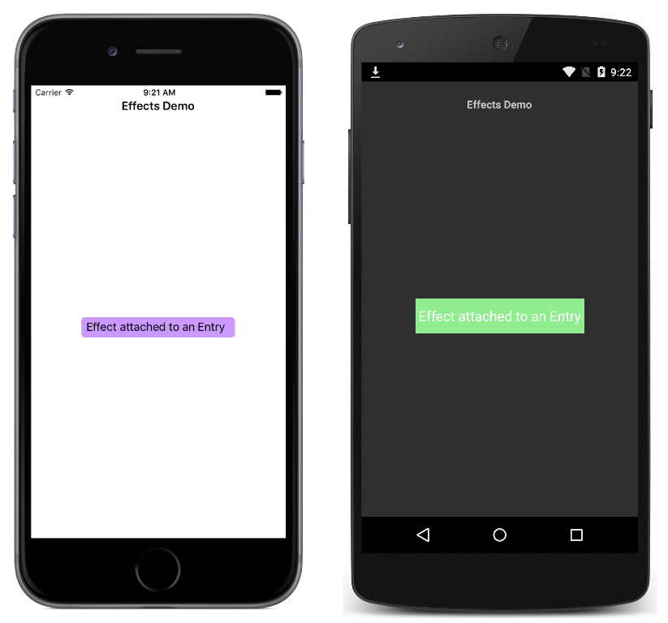

# BackgroundColor Effect

This sample demonstrates creating an effect for the `Entry` control, that changes the background color of the control.

For more information about the sample see [Creating an Effect](https://docs.microsoft.com/xamarin/xamarin-forms/app-fundamentals/effects/creating).

## Author

David Britch
