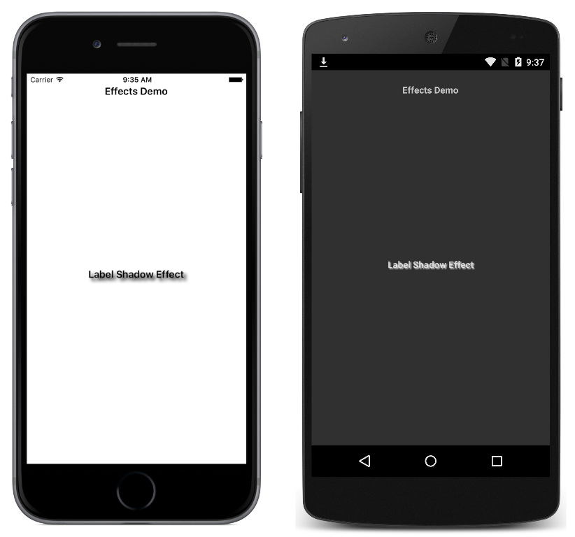

# Shadow Effect

This sample demonstrates using CLR properties to pass parameters to an effect.

For more information about the sample see [Creating an Effect](https://docs.microsoft.com/xamarin/xamarin-forms/app-fundamentals/effects/creating), and [Passing Parameters to an Effect](https://docs.microsoft.com/xamarin/xamarin-forms/app-fundamentals/effects/passing-parameters/).

## Author

David Britch
