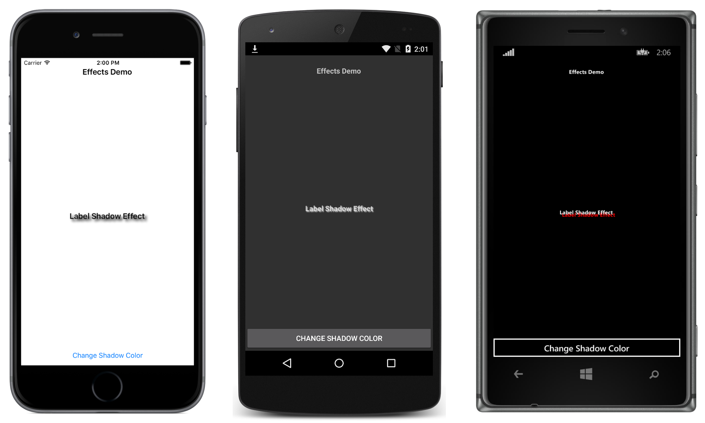

# Shadow Effect with Runtime Parameter Change

This sample demonstrates using attached properties to pass parameters to an effect, and changing a parameter at runtime.

For more information about the sample see [Creating an Effect](https://docs.microsoft.com/xamarin/xamarin-forms/app-fundamentals/effects/creating), and [Passing Parameters to an Effect](https://docs.microsoft.com/en-us/xamarin/xamarin-forms/app-fundamentals/effects/passing-parameters/).

## Author

David Britch
