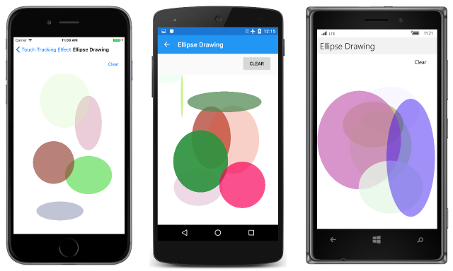

# Touch-Tracking Effect Demos

This sample demonstrates an effect that implements multi-touch finger tracking, and shows how to trigger events from an effect.

For more information about the sample see [Invoking Events from Effects](https://developer.xamarin.com/guides/xamarin-forms/application-fundamentals/effects/touch-tracking/).

## Author

Charles Petzold
