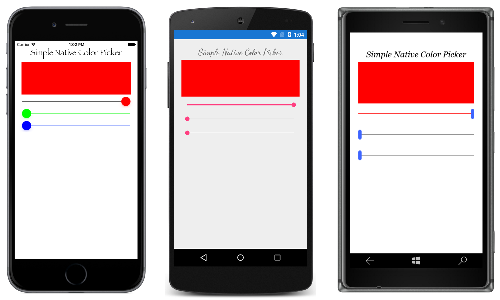

# Forms2Native

This sample demonstrates how to add native views to a Xamarin.Forms page, and how they can interact with Xamarin.Forms views.

For more samples, and more information about this sample see [Native Views](https://docs.microsoft.com/xamarin/xamarin-forms/platform/native-views/).

## Author

Charles Petzold / David Britch
