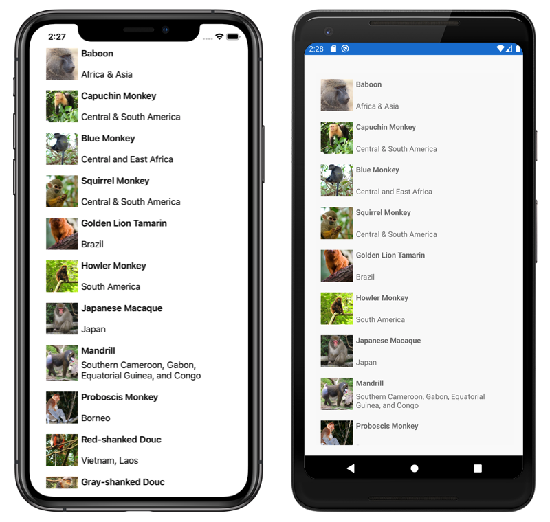

# CollectionView Tutorial

This sample demonstrates how to present lists of data, using the Xamarin.Forms `CollectionView`.

For more information about this sample, see [CollectionView Tutorial](https://docs.microsoft.com/xamarin/get-started/tutorials/collectionview/).

