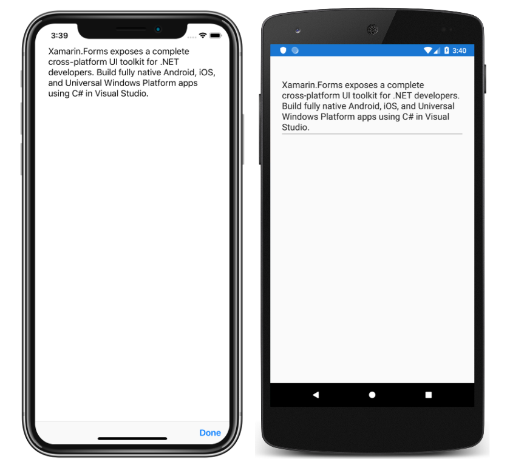

# Editor Tutorial

This sample demonstrates how to accept multi-line text input, using the Xamarin.Forms `Editor` view.

For more information about this sample, see [Editor Tutorial](https://docs.microsoft.com/xamarin/get-started/tutorials/editor/).

