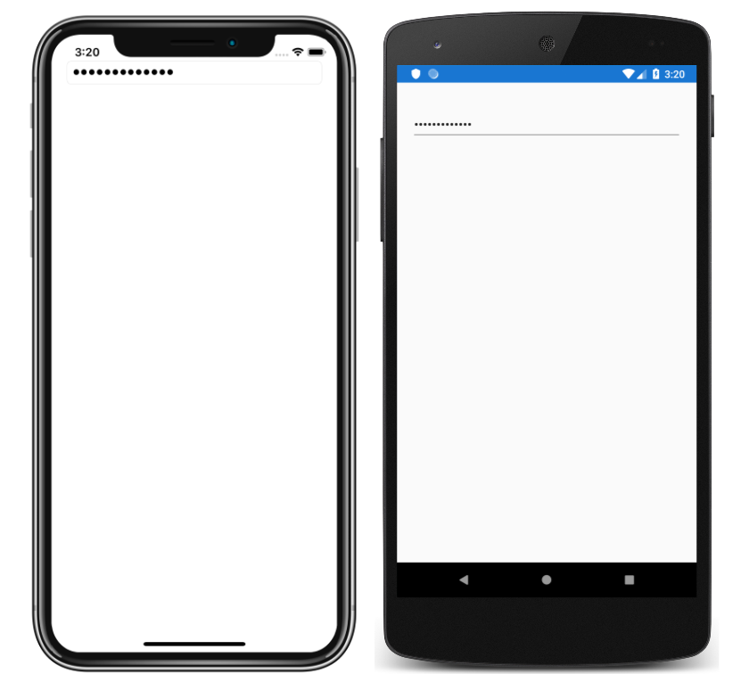

# Entry Tutorial

This sample demonstrates how to accept single-line text input, using the Xamarin.Forms `Entry` view.

For more information about this sample, see [Entry Tutorial](https://docs.microsoft.com/xamarin/get-started/tutorials/entry/).

