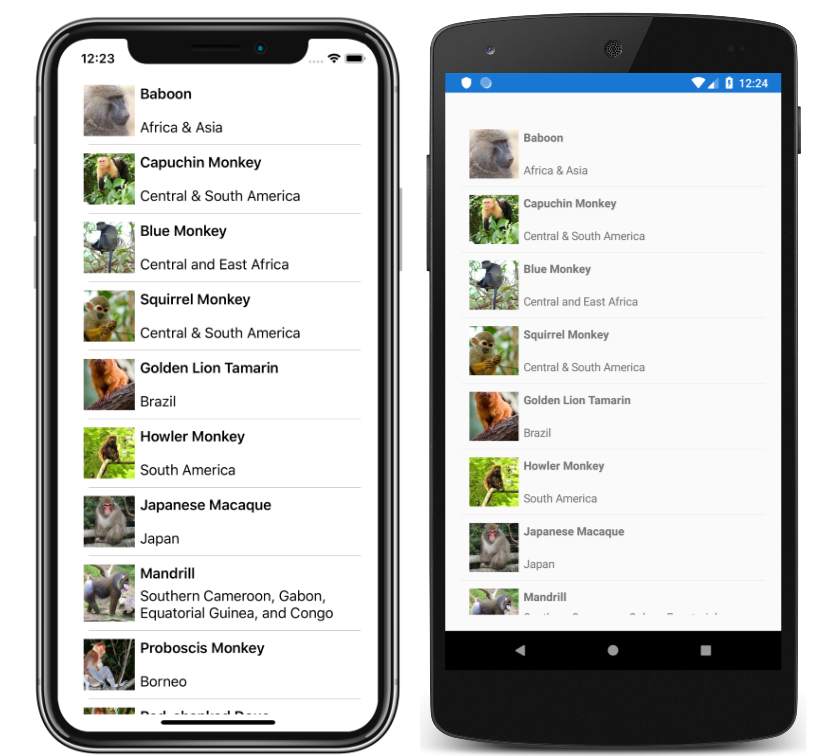

# ListView Tutorial

This sample demonstrates how to present lists of data, using the Xamarin.Forms `ListView`.

For more information about this sample, see [ListView Tutorial](https://docs.microsoft.com/xamarin/get-started/tutorials/listview/).

