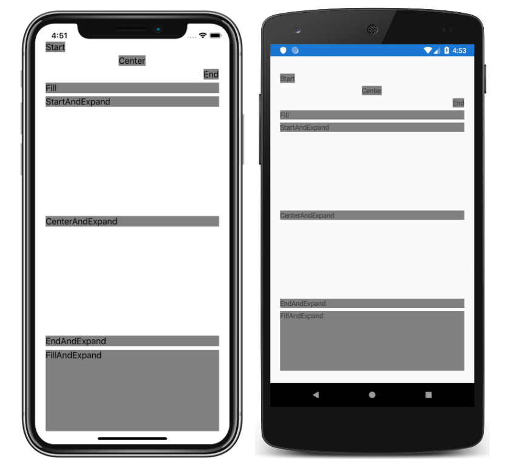

# StackLayout Tutorial

This sample demonstrates how to organize views in a one-dimensional stack, with the Xamarin.Forms `StackLayout`, either horizontally or vertically.

For more information about this sample, see [StackLayout Tutorial](https://docs.microsoft.com/xamarin/get-started/tutorials/stacklayout/).

