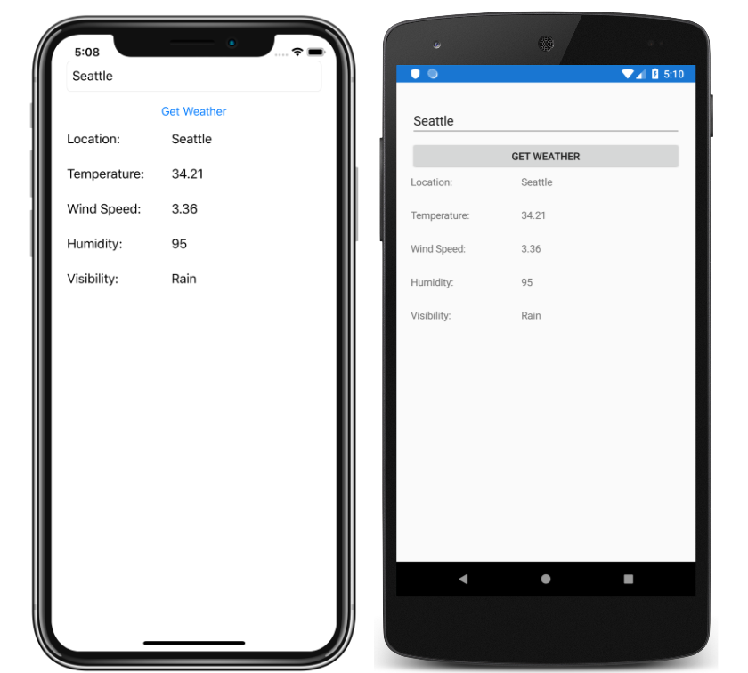

# Web Service Tutorial

This sample demonstrates how to consume REST-based web services from Xamarin.Forms applications.

For more information about this sample, see [Web Service Tutorial](https://docs.microsoft.com/xamarin/get-started/tutorials/web-service/).

