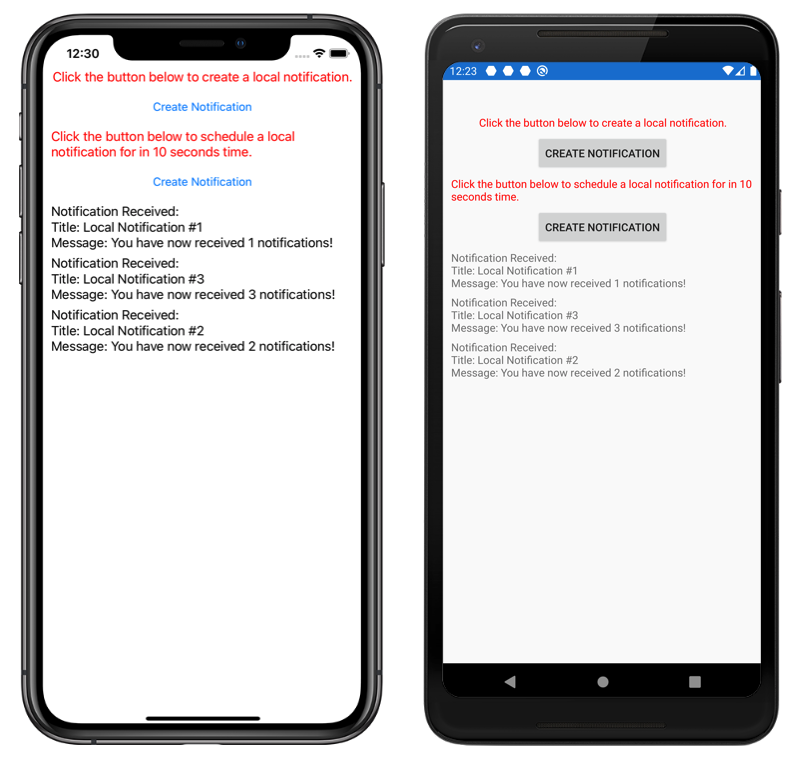

# Local notification demo

Local notifications are alerts sent by applications installed on the mobile device. This sample demonstrates how to create and use a cross-platform interface to send and receive local notifications in Xamarin.Forms.

For more information about this sample, see [Xamarin.Forms local notifications](https://docs.microsoft.com/xamarin/xamarin-forms/app-fundamentals/local-notifications).

