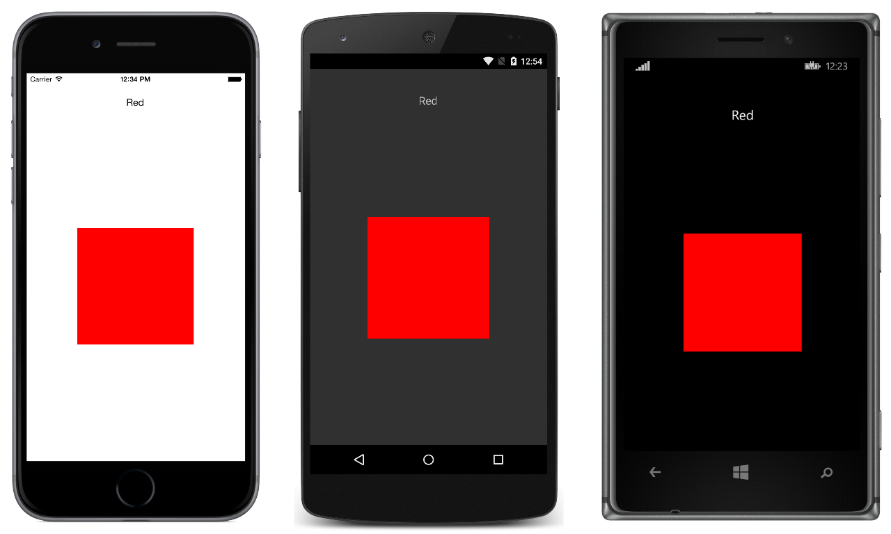

# CarouselPage

This sample demonstrates how to use a `CarouselPage` to navigate through a collection of pages. The `CarouselPage` is constructed by populating it with a collection of child `Page` objects.

For more information about the sample see [Carousel Page](http://developer.xamarin.com/guides/cross-platform/xamarin-forms/user-interface/navigation/carousel-page/).

## Author

David Britch
