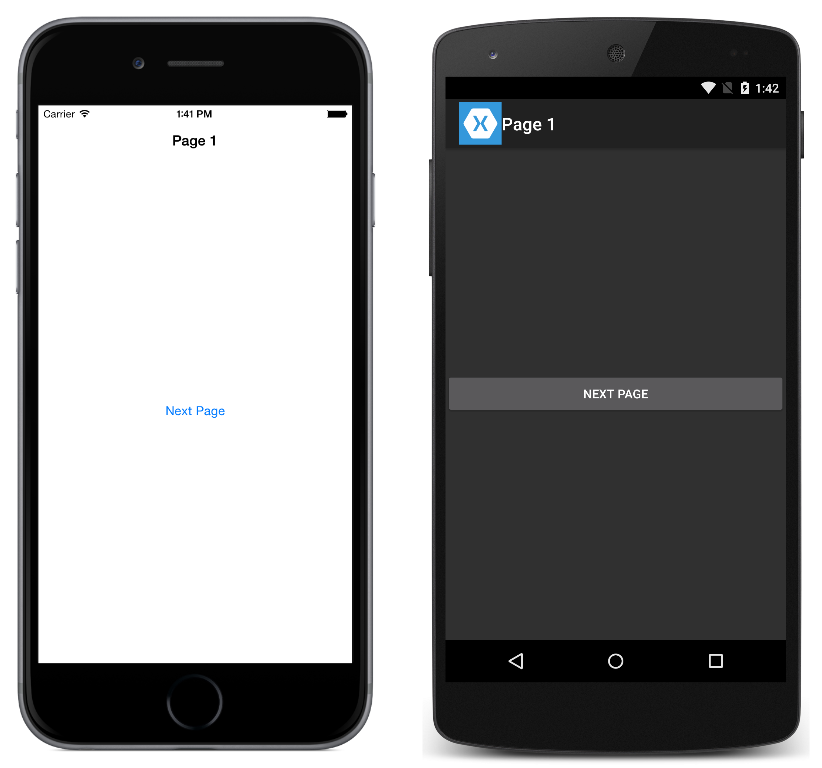

# Hierarchical Navigation

This sample demonstrates how to perform hierarchical navigation through a stack of pages in Xamarin.Forms.

For more information about the sample see [Hierarchical Navigation](https://docs.microsoft.com/xamarin/xamarin-forms/app-fundamentals/navigation/hierarchical).

