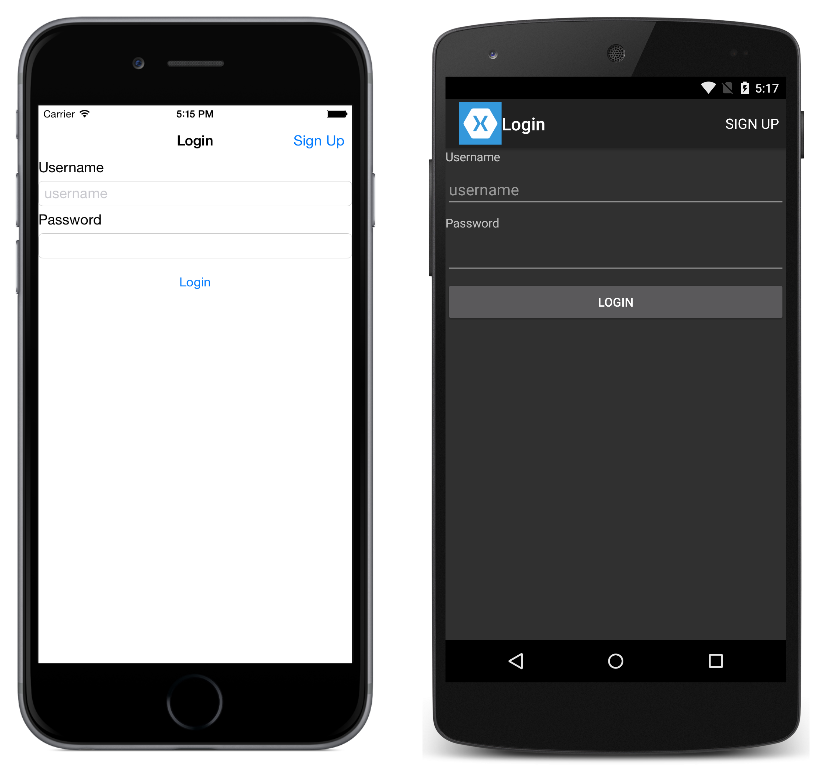

# LoginFlow

This sample demonstrates how to manipulate the navigation stack in order to only display the main page of the application once the user has successfully logged in.

For more information about the sample see [Hierarchical Navigation](https://docs.microsoft.com/xamarin/xamarin-forms/app-fundamentals/navigation/hierarchical).

