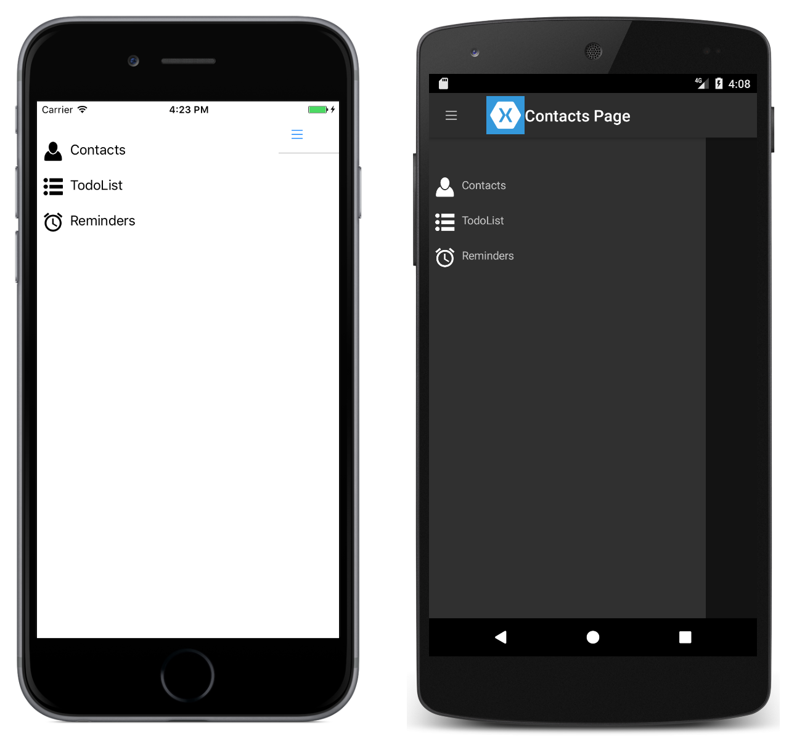

# MasterDetailPage

This sample demonstrates how to use a `MasterDetailPage` and navigate between its pages of information.

For more information about the sample see [Master-Detail Page](https://docs.microsoft.com/xamarin/xamarin-forms/app-fundamentals/navigation/master-detail-page).

