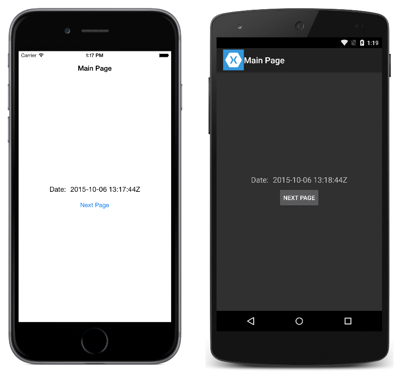

# Passing Data

This sample demonstrates how to pass data between pages when navigating.

For more information about the sample see [Hierarchical Navigation](http://developer.xamarin.com/guides/cross-platform/xamarin-forms/user-interface/navigation/hierarchical/).

## Author

David Britch
