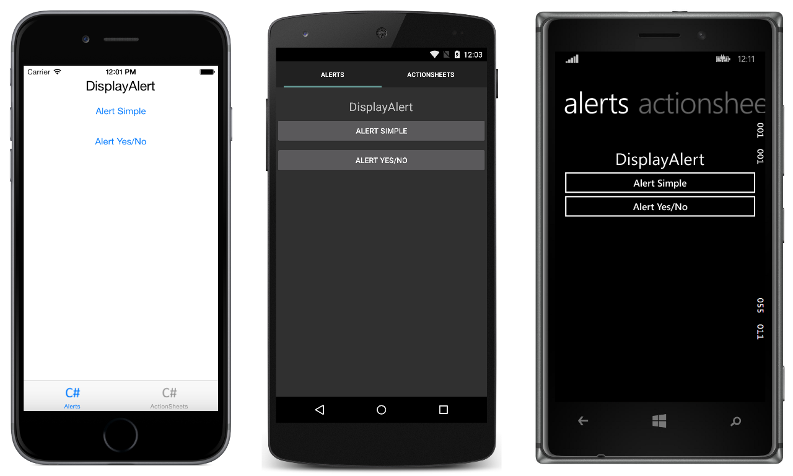

# Displaying Pop-ups

This sample demonstrates using the alert and action sheet APIs to ask users simple questions and guide users through tasks.

For more information about the sample see [Displaying Pop-ups](https://docs.microsoft.com/xamarin/xamarin-forms/user-interface/pop-ups).

