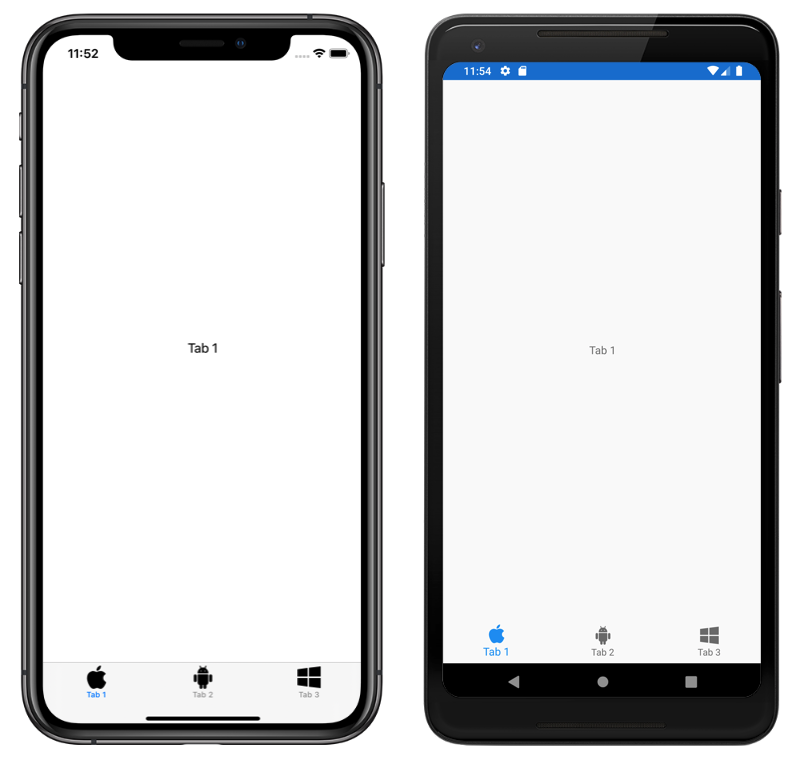

# Xamarin.Forms TabbedPage with SVG tab icons

This sample demonstrates how to display Scalable Vector Graphic (SVG) files as tab icons in a Xamarin.Forms [`TabbedPage`](xref:Xamarin.Forms.TabbedPage).

For more information about this sample, see [Xamarin.Forms TabbedPage](https://docs.microsoft.com/xamarin/xamarin-forms/app-fundamentals/navigation/tabbed-page).

