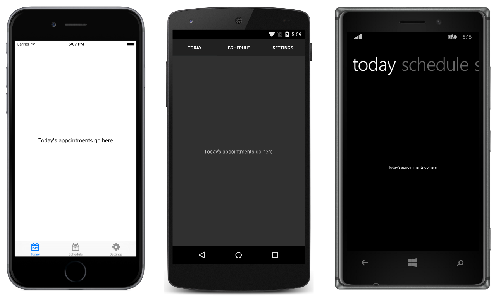

# TabbedPage with NavigationPage

This sample demonstrates how embed a `NavigationPage` in a `TabbedPage`, in order to perform page navigation within a tab. The `TabbedPage` is constructed by populating it with a collection of child `Page` objects.

For more information about the sample see [Tabbed Page](http://developer.xamarin.com/guides/cross-platform/xamarin-forms/user-interface/navigation/tabbed-page/).

## Author

David Britch
