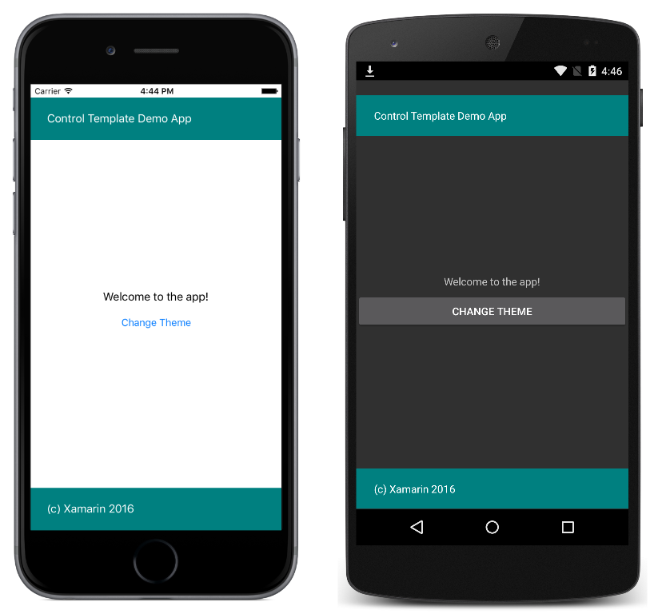

# Simple Theme

This sample demonstrates using a `ControlTemplate` to theme a `ContentPage` and change the theme at runtime.

For more information about the sample see [Control Templates](https://docs.microsoft.com/xamarin/xamarin-forms/app-fundamentals/templates/control-templates/).

