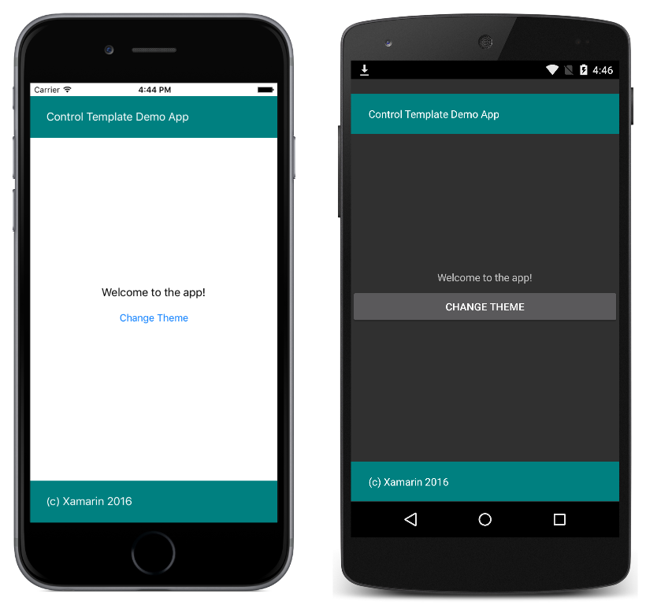

# Simple Theme with Template Binding

This sample demonstrates using a `ControlTemplate` with a `TemplateBinding` to theme a `ContentPage` and change the theme at runtime

For more information about the sample see [Control Templates](http://developer.xamarin.com/guides/xamarin-forms/templates/control-templates/).

## Author

David Britch
