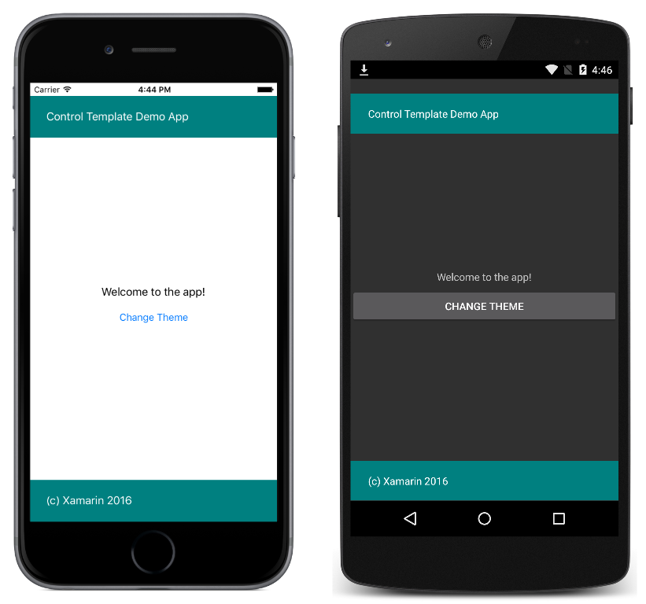

# Simple Theme with Template Binding and ViewModel

This sample demonstrates using a `ControlTemplate` with a `TemplateBinding`, that in turn binds to a ViewModel, to theme a `ContentPage` and change the theme at runtime.

For more information about the sample see [Control Templates](https://docs.microsoft.com/en-us/xamarin/xamarin-forms/app-fundamentals/templates/control-templates/).

