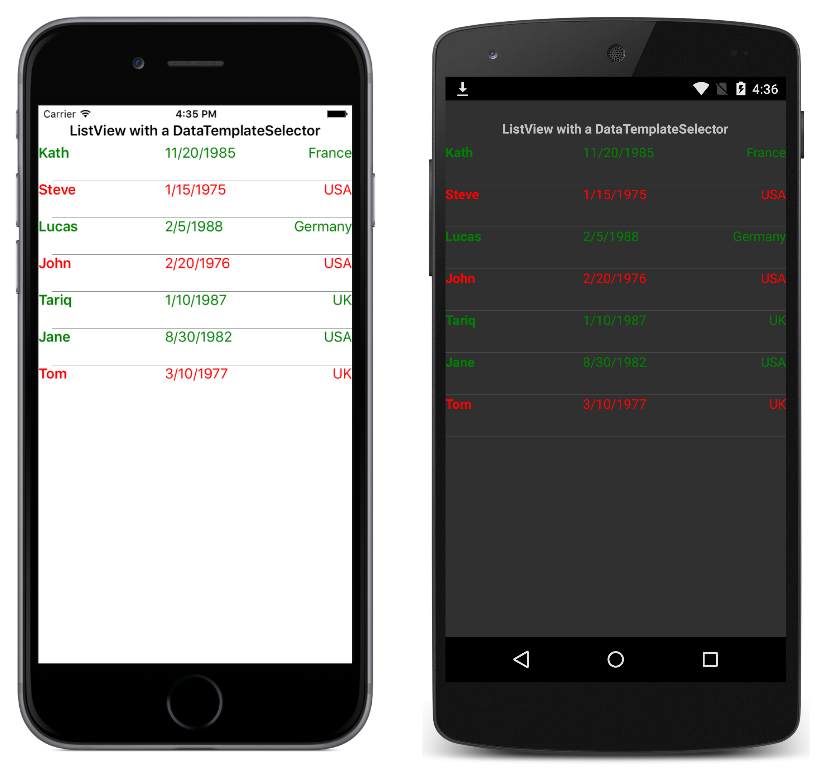

# Data Template Selector

This sample demonstrates using a `DataTemplateSelector` to select a `DataTemplate` at runtime per item in a `ListView`.

For more information about the sample see [Data Template Selector](https://docs.microsoft.com/xamarin/xamarin-forms/app-fundamentals/templates/data-templates/selector).

