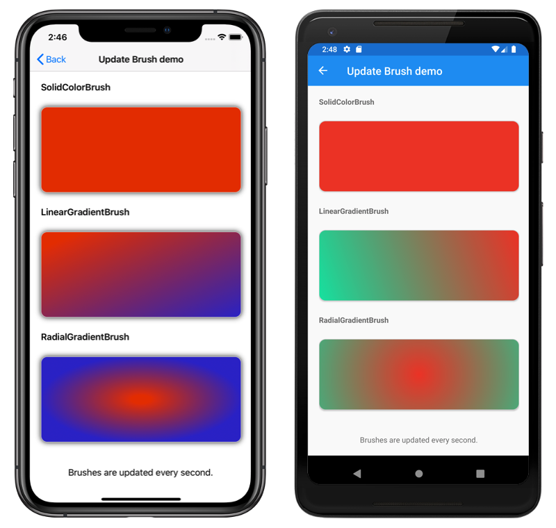

# Brushes

This sample demonstrates how to paint an area with a Xamarin.Forms brush.

For more information about this sample, see [Xamarin.Forms Brushes](https://docs.microsoft.com/xamarin/xamarin-forms/user-interface/brushes/).

