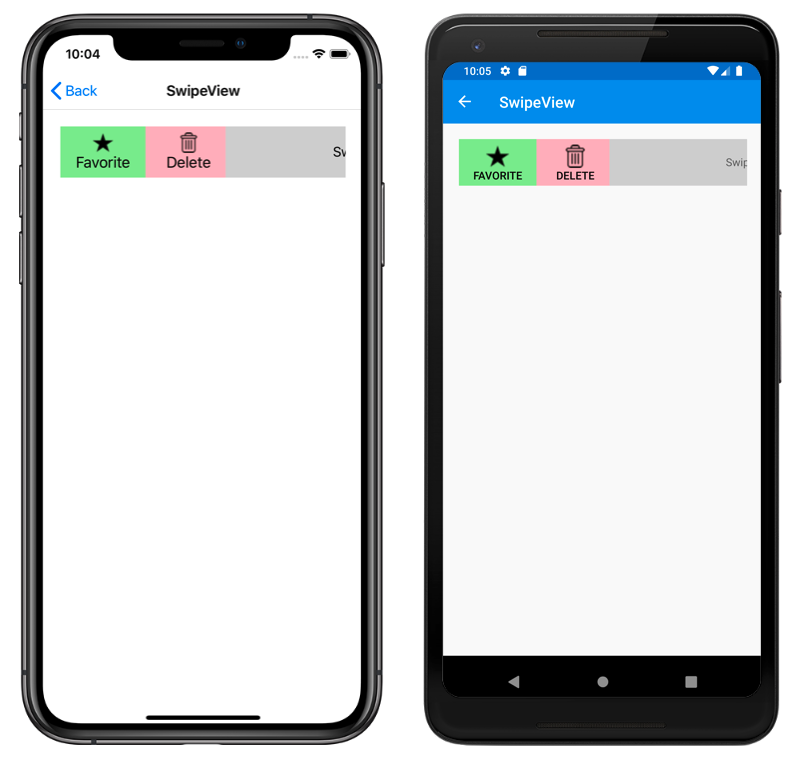

# SwipeView

This sample demonstrates how to use the Xamarin.Forms `SwipeView`.

For more information about this sample, see [Xamarin.Forms SwipeView](https://docs.microsoft.com/xamarin/xamarin-forms/user-interface/swipeview/).

