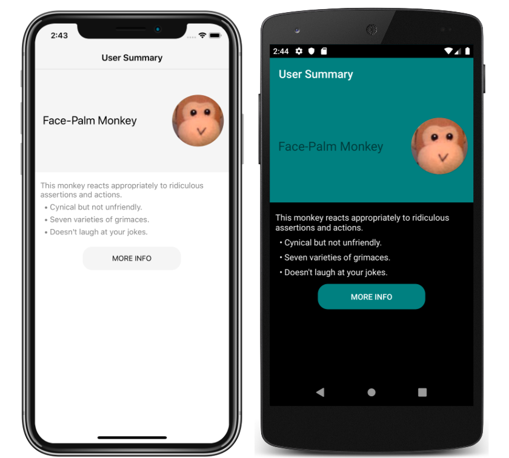

# Respond to System Theme Changes

Xamarin.Forms applications can respond to operating system theme changes by defining resources with the `AppThemeColor` class, the `OnAppTheme<T>` class, and the `OnAppTheme` markup extension, and then consuming these resources with the `DynamicResource` markup extension.

This sample demonstrates a Xamarin.Forms application that responds to system theme changes.

For more information about this sample, see [Respond to system theme changes in Xamarin.Forms applications](https://docs.microsoft.com/xamarin/xamarin-forms/user-interface/theming/system-theme-changes/).

