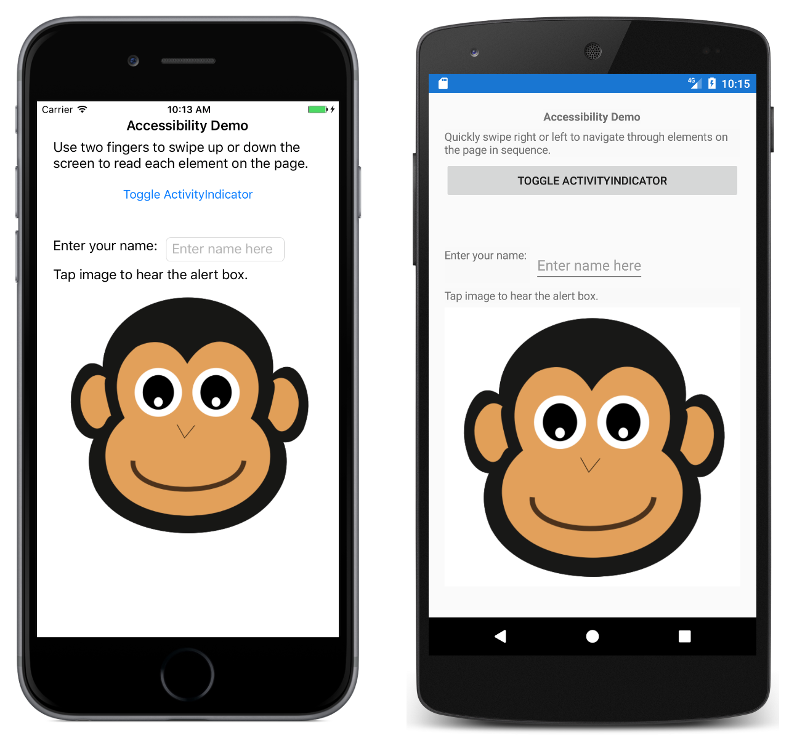

# Accessibility

This sample demonstrates how to use the `AutomationProperties` class, so that a screen reader can speak about the user interface elements on the page.

When running this sample with VoiceOver enabled on iOS, use two fingers to swipe up or down the screen to read all of the elements on the page, and use three fingers to scroll.

When running this sample with TalkBack enabled on Android, swipe one finger across the screen to read each element on the page, and use two fingers to scroll.

When running this sample with Narrator enabled on the Universal Windows Platform, use three fingers to swipe up the screen to read all of the elements on the page, and use two fingers to scroll.

On all platforms, tap an element once to hear accessibility values. Double tap anywhere on the screen to activate the selected element. Swipe left or right with one finger to switch to the previous or next element.

For more information about this sample see [automation properties in Xamarin.Forms](https://docs.microsoft.com/xamarin/xamarin-forms/app-fundamentals/accessibility/automation-properties).

