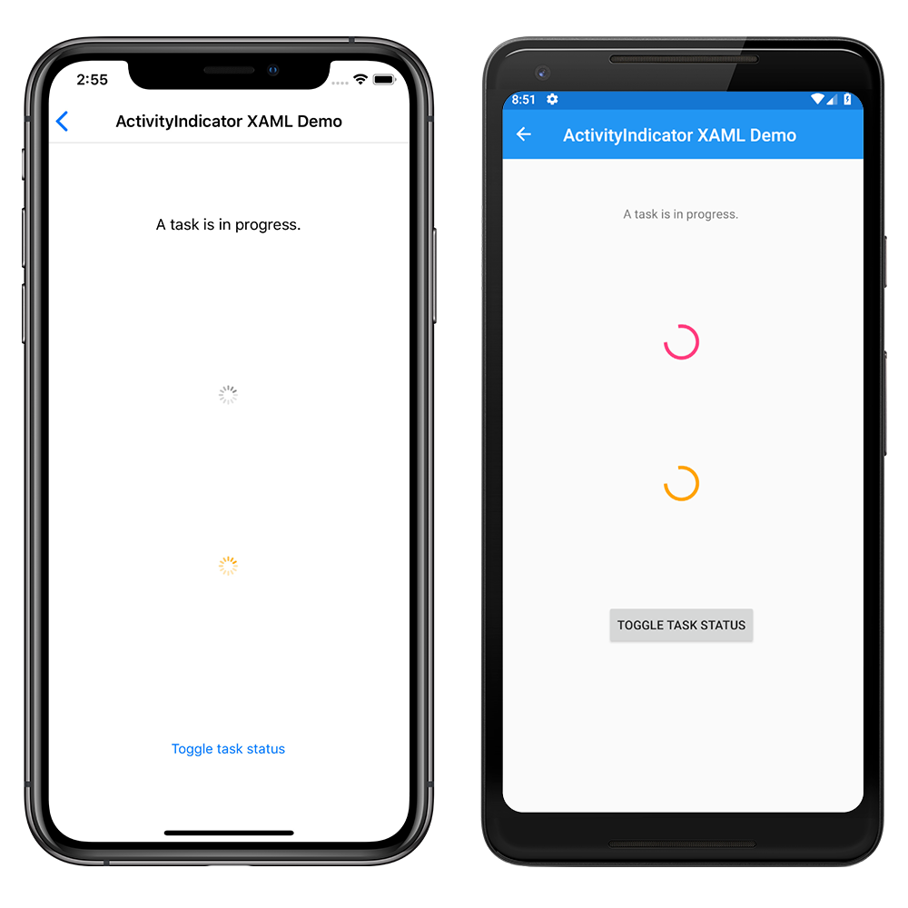

# ActivityIndicator Demos

The ActivityIndicator control indicates to users that the application is busy performing a task. This sample demonstrates how to use an `ActivityIndicator` in XAML and code.

For more information about this sample, see [Xamarin.Forms ActivityIndicator](https://docs.microsoft.com/xamarin/xamarin-forms/user-interface/activityindicator).

