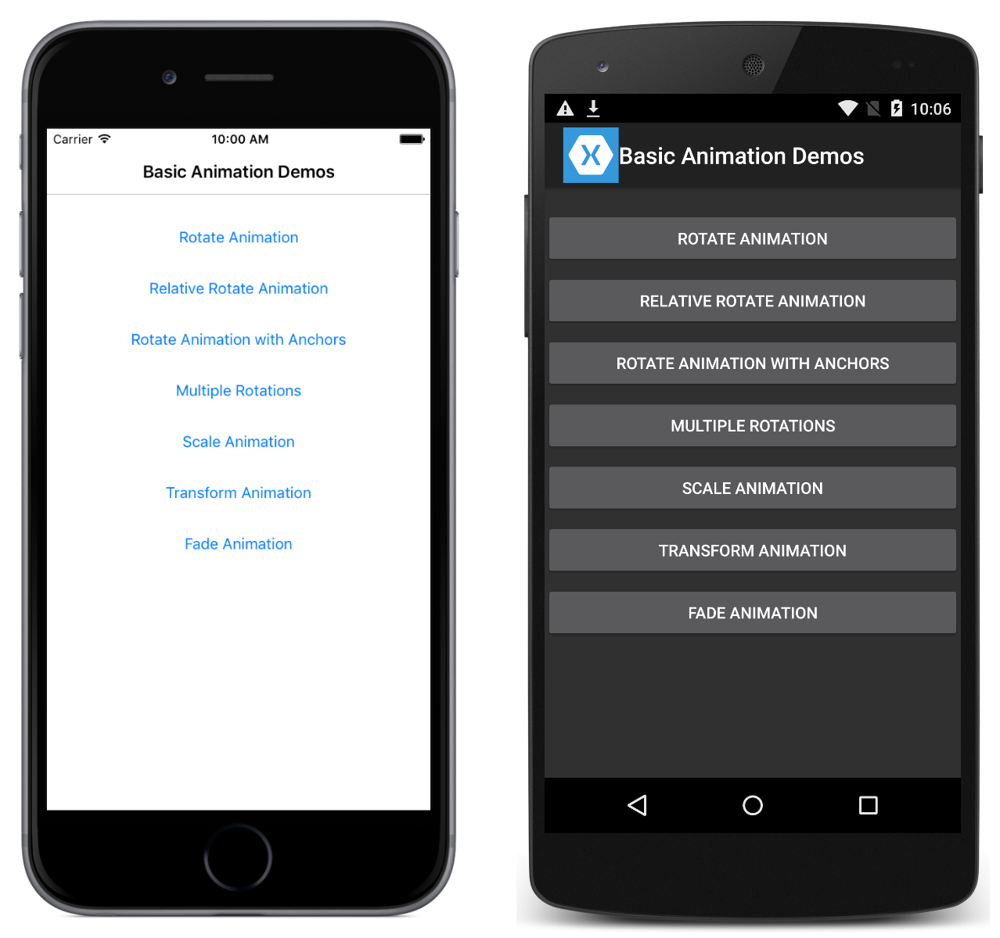

# Basic Animation

The `ViewExtensions` class provides extension methods that can be used to construct simple animations. This sample demonstrates creating and canceling animations using the `ViewExtensions` class.

For more information about the sample see [Simple Animations](https://docs.microsoft.com/xamarin/xamarin-forms/user-interface/animation/simple).

