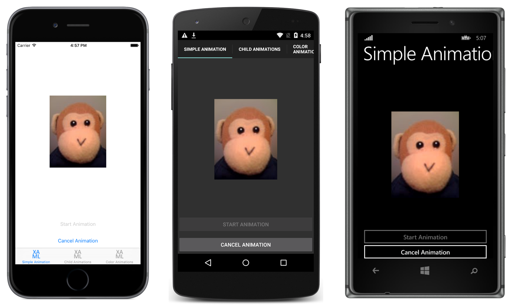

# Custom Animations

The `Animation` class is the building block of all Xamarin.Forms animations, with the extension methods in the `ViewExtension`s class creating one or more `Animation` objects. This sample demonstrates how to use the `Animation` class to create and cancel animations, synchronize multiple animations, and create custom animations that animate properties that aren't animated by the existing animation methods.

For more information about the sample see [Custom Animations](http://developer.xamarin.com/guides/xamarin-forms/user-interface/animation/custom/).

## Author

David Britch
